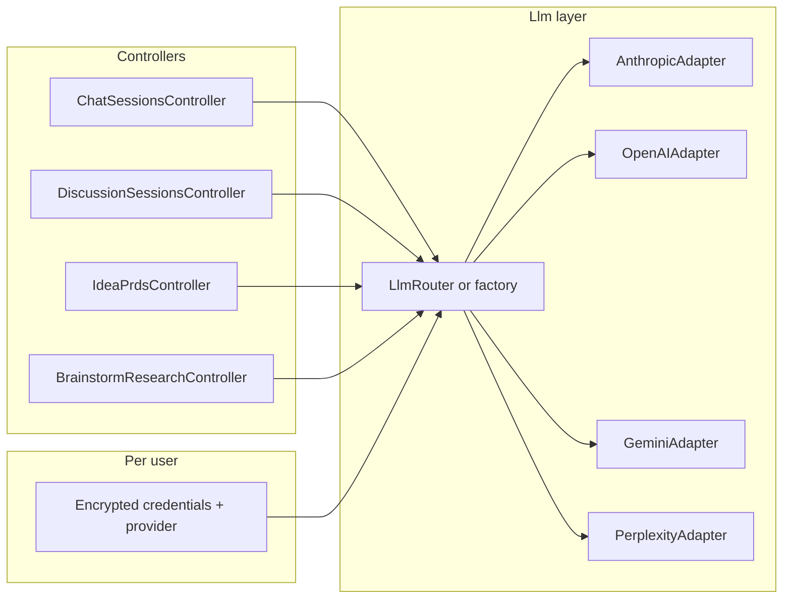

# AI provider–agnostic (BYOK) plan

## Current state

All LLM usage lives in **[apps/api](../apps/api)** behind a single env var **`ANTHROPIC_API_KEY`** and the **`anthropic`** gem:

| Surface | Service | Notes |
| --- | --- | --- |
| Brainstorm chat (SSE) | [ClaudeChatService](../apps/api/app/services/claude_chat_service.rb) | Streaming; model `claude-sonnet-4-6` |
| Idea discussion (SSE) | Same service via [DiscussionSessionsController](../apps/api/app/controllers/discussion_sessions_controller.rb) | Same |
| PRD generation | [IdeaPrdService](../apps/api/app/services/idea_prd_service.rb) | Streaming |
| Idea analysis | [IdeaAnalysisService](../apps/api/app/services/idea_analysis_service.rb) | Uses **Anthropic web search tool** (`web_search_20250305`) |
| Brainstorm research | [BrainstormResearchService](../apps/api/app/services/brainstorm_research_service.rb) | Same **web search tool** + JSON parsing |

[users](../apps/api/db/schema.rb) has **no** credential columns today.

## Critical constraint: tool-based flows vs generic chat

**Research** (`BrainstormResearchService`) and **idea analysis** (`IdeaAnalysisService`) are **not** plain text completion. They call the Anthropic Messages API with the built-in **`web_search_20250305`** tool (see `tools:` / `web_search` in those services). That contract is **vendor-specific**: OpenAI, Gemini, and Perplexity expose different primitives (Responses + tools, grounding, native search, etc.).

Multi-provider BYOK therefore **requires explicit capability mapping**, not a single “swap the API key” path for every screen:

| Capability (server-defined) | Anthropic (current) | Other providers (initially) |
| --- | --- | --- |
| `streaming_chat` | Yes | Map per adapter when implemented |
| `prd_streaming` | Yes | Same |
| `web_research_json` (structured JSON + web) | Yes (native tool) | **No default parity**—needs per-provider implementation or stays disabled |

**Design rules:**

1. **Capability registry** — Central Ruby module (or DB-backed config) lists **which features** each `provider` supports, optionally refined by model. User’s effective capabilities = **intersection** of (registry for provider) and (whether a valid key exists).
2. **No silent fallback** — If the user selects OpenAI but research still requires Anthropic’s tool, the API must return **422 or a clear error** and/or **`capabilities.web_research: false`** so clients hide or disable Research / “full analysis” until implemented.
3. **Incremental implementations** — Adding “Perplexity research” means a **new code path** (prompt + response shape + parsing), not only a new API key field.
4. **BYOK MVP** — Using **Anthropic + user key** preserves **full** research/analysis behavior with minimal code change; multi-provider expands **chat/PRD first**, then **separate** research adapters.

## Target behavior

- **User-provided keys (BYOK)**: Each user can choose a **provider** (e.g. `anthropic`, `openai`, `google`, `perplexity`) and store an **API key** used for their requests when present.
- **Hosted fallback (optional product decision)**: Keep **`ANTHROPIC_API_KEY`** (or a renamed server key) so the app works without BYOK for paying/hosted tiers—or require BYOK only; this should be an explicit product flag.

## Architecture

**Capability gate** (not in diagram above): Before `BrainstormResearchController` / analysis jobs run tool-based code, **`LlmCapabilities.for(user)`** (or equivalent) must assert **`web_research_json`** (or Anthropic-specific flag). Controllers/services that only need streaming chat consult **`streaming_chat`**. The registry is the single source of truth so multi-provider support cannot drift into “broken research on OpenAI.”

**Core abstraction** (names illustrative):

- Define a small **protocol** in Ruby, e.g. `LlmClient#stream_chat(system:, messages:, model:, &block)` and `LlmClient#complete(...)` for non-streaming paths.
- Implement **one adapter per provider**, mapping a **normalized message list** (`role` + `content` string) to each vendor’s HTTP/SDK shape and **streaming** semantics (SSE chunking already exists in controllers; adapters only yield text chunks).
- A **`LlmClient.for_user(current_user)`** (or `ResolveLlmCredentials`) picks:
  1. User’s encrypted key + provider + optional model override, else
  2. Server `ENV` fallback (if enabled).

**Model IDs**: Do not hardcode one model globally in services. Store a **per-provider default** in code (constants) and allow an optional **user-selected model** from a **curated allowlist** per provider (avoid arbitrary strings to reduce injection/support burden).

## Feature parity and limitations (ties to capability mapping)

**Chat + PRD + analysis paths that only need** `messages.create` / streaming **without** Anthropic web tools: Candidates for **multi-provider adapters** once streaming is implemented per vendor.

**Research + “full” analysis with web**: Implemented only on **Anthropic + `web_search_20250305`** today. Porting to another vendor is a **feature project** per provider (different APIs, tool shapes, and output parsing)—tracked as separate capabilities in the registry (e.g. `web_research_anthropic`, future `web_research_openai`).

**Recommended phased delivery:**

1. **Phase A (BYOK MVP)**: **Anthropic-only** user keys (same SDK and tools as today)—validates encryption, settings UI, and `LlmClient` wiring; **full** research/analysis unchanged.
2. **Phase B**: **OpenAI** (and optionally **Gemini**) for **chat + PRD + non-tool analysis** only; capability API marks `web_research` false unless user also has Anthropic configured or server fallback exists.
3. **Phase C**: Optional **per-provider research backends**; each adds a row in the capability registry and dedicated service code—**never** assume one adapter handles all flows.

Expose structured **`capabilities`** (and human-readable **`capability_messages`** if useful) from **`/me/llm_settings`** and optionally from **feature-specific GETs** (e.g. brainstorm show) so **web** and **mobile** can disable Research tab actions or show “Configure Anthropic for web research” copy.

## Data and security

- **New table** e.g. `user_llm_settings`: `user_id` (unique), `provider` (string), `encrypted_api_key` (text), optional `model`, `updated_at`. Alternatively use Rails **Active Record Encryption** on columns on `users`—table is cleaner for rotation and auditing.
- **Never** return the full key to clients; return **`masked_key`** (last 4 chars) and `provider`, `model`.
- **Encryption**: Use **Rails 7+ Active Record encryption** (or `lockbox`) with keys in `RAILS_MASTER_KEY` / credentials; document key rotation.
- **Transport**: Keys only sent over HTTPS; consider **one-time save** from client with server-side validation (optional lightweight “test key” ping before persist).
- **Logging**: Audit adapters to ensure **no API keys** in logs or error payloads.

## API and auth

- **`GET /api/v1/me/llm_settings`** (or under existing `users` resource): masked settings + capabilities.
- **`PATCH /api/v1/me/llm_settings`**: `provider`, `api_key` (optional clear to remove), `model` (optional).
- **`DELETE`**: clear BYOK; fall back to server key if allowed.

Wire [Authenticatable](../apps/api/app/controllers/concerns/authenticatable.rb) as today; only the **authenticated user** may change their own credentials.

## Clients

- **[apps/web](../apps/web)**: New **Settings → AI** section (Client Components): provider select, API key input, model dropdown from server-provided allowlists, test connection, clear key. Match existing settings patterns.
- **[apps/mobile](../apps/mobile)**: Same flows on Profile or Settings stack; secure text entry, link to provider docs.

## Testing and ops

- **Unit tests**: Mock adapters; test router chooses user key vs env.
- **Integration**: Optional VCR or stubbed HTTP for one provider.
- **Docs**: [README](../README.md) env vars + BYOK behavior; `.env.example` unchanged for server key if retained.

## Dependencies

- Add gems or HTTP clients as needed: e.g. **`ruby-openai`** or raw `Faraday` for OpenAI-compatible APIs; **`google-cloud-ai`** or REST for Gemini—keep each adapter isolated.
- Keep **`anthropic`** for Anthropic adapter to avoid rewriting streaming.

## Summary

Implement a **router + per-provider adapters**, **encrypted per-user credentials**, and a **first-class capability registry** so research/analysis (Anthropic web tools) are never implied to work on every provider. Ship **Anthropic BYOK first** (preserves all features), then add other providers for **streaming-only** flows, and add **separate** research implementations only when each vendor’s search/tooling is mapped and tested.
