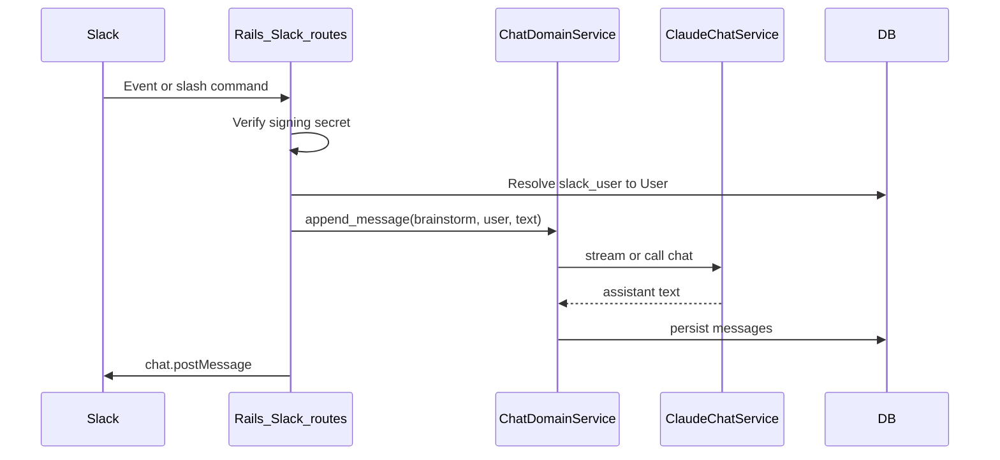

# Milestone — Slack and Teams apps (shared backend)

**Goal:** Ship Slack and (optionally) Microsoft Teams experiences that use the **same** Rails domain logic as the web app: `ChatSession`, Ideabot / discussion chat, `editable_by?`, and `ClaudeChatService`. Each channel is a **thin adapter** (HTTP ingress + identity + outbound messages), not a second copy of product rules.

**Overview:** Extract shared chat services from controllers first, then add Slack (Events API, OAuth, signing verification) and Teams (Bot Framework, Azure identity) as separate integration layers.

---

## Checklist (high level)

- [ ] Extract brainstorm + idea chat message flow from controllers into service objects callable from HTTP, Slack, and Teams
- [ ] Add migrations for Slack workspace install (`team_id`, tokens) and `slack_user_id` ↔ `user_id` linking
- [ ] Implement Slack OAuth install/callback and encrypted token storage; optional “Add to Slack” from web when logged in
- [ ] Add verified Slack Events + slash command routes; map Slack user to `User` and resolve brainstorm/idea context
- [ ] Ship Slack v1 UX (slash command + thread replies or ephemeral help); post full assistant reply to Slack (no SSE)
- [ ] Request specs for signing verification and permission parity; env vars in `apps/api/.env.example`
- [ ] (After Slack v1 or in parallel) Teams Bot messaging endpoint, tenant + bot registration, map Teams user to `User`, reply via Bot Framework

---

## Slack: architecture

### Current backend touchpoints (reuse targets)

- **Brainstorm Ideabot:** [`apps/api/app/controllers/chat_sessions_controller.rb`](../../apps/api/app/controllers/chat_sessions_controller.rb) — loads brainstorm, `find_or_create_session`, appends user message, optionally streams via `ClaudeChatService#stream_chat`, persists assistant message.
- **Idea discussion:** [`apps/api/app/controllers/discussion_sessions_controller.rb`](../../apps/api/app/controllers/discussion_sessions_controller.rb) — parallel flow for ideas (active session, archive, etc.).
- **Auth today:** JWT via [`apps/api/app/controllers/concerns/authenticatable.rb`](../../apps/api/app/controllers/concerns/authenticatable.rb); routes under [`apps/api/config/routes.rb`](../../apps/api/config/routes.rb) (`:username/brainstorms/:slug/chat/...`, idea discussion routes).
- **User model:** [`apps/api/app/models/user.rb`](../../apps/api/app/models/user.rb) — no Slack/Teams fields yet; [`users`](../../apps/api/db/schema.rb) has `email`, `google_uid`, `username`.

Slack cannot send browser JWTs; you need **Slack OAuth + stored links** from Slack identity → `User`.

### 1. Extract shared domain services (foundation)

**Why:** Controllers today mix HTTP concerns (SSE, params) with chat logic. Slack/Teams handlers need the **same** persistence and AI calls without duplicating `build_system_prompt`, `ideabot_trigger?`, or permission checks.

**Approach:**

- Introduce something like `BrainstormChat::SendMessage` / `IdeaDiscussion::SendMessage` (names illustrative) that accept `brainstorm` or `idea`, `user`, `content`, and return structured result `{ user_message, assistant_message, streamed: false }`.
- Move or delegate from `ChatSessionsController#create_message` and `DiscussionSessionsController#create_message` to these services.
- **Streaming:** Web keeps SSE by passing a block into the service; Slack/Teams paths collect the full string and return once (same `ClaudeChatService` stream, different consumer).

This keeps **one** implementation of “what happens when someone sends Ideabot a message.”

### 2. Data model for Slack

Add tables (exact names flexible):

- **`slack_installations`** (or similar): `slack_team_id` (unique), `bot_user_id`, encrypted `bot_token`, `installed_at`, optional link to a “connecting” user for audit.
- **`slack_user_accounts`**: `slack_team_id` + `slack_user_id` (unique together) → `user_id`, `created_at`. Enforces one IdeaMode user per Slack user per workspace.

Optional later: **`slack_channel_contexts`** mapping `channel_id` + `thread_ts` → `username/slug` + resource type (brainstorm vs idea) so users do not repeat args every time.

### 3. Slack app configuration (product + Slack API)

- Create a Slack app (manifest or UI): define **OAuth scopes** minimally (e.g. `chat:write`, `commands`, `users:read.email` if matching by email, `app_mentions:read` if you use mentions).
- **Redirect URLs** for OAuth install pointing to Rails, e.g. `POST`/`GET` callback under `/slack/oauth/callback` (exact pattern per Slack docs).
- Store **signing secret** and **client id/secret** in env ([`apps/api/.env.example`](../../apps/api/.env.example)).

### 4. Identity: linking Slack users to IdeaMode users

Pick one **v1** strategy (can combine later):

- **A. Email match:** During install or first use, use Slack `users.info` with `users:read.email` and match `User.email` (case-insensitive). Unmatched users get a short **linking URL** to the web app (one-time token) to bind their account.
- **B. Explicit link command:** `/ideamode link` opens a browser OAuth or pastes a code shown in the web app’s Settings.

Until linked, Slack commands return a clear “Connect your IdeaMode account” message.

### 5. Rails: Slack HTTP surface

- **`POST /slack/events`**: URL verification (`challenge`) + event subscriptions. Verify **Slack signing secret** on every request (middleware or before_action).
- **`POST /slack/interactive`** (if using modals/buttons later).
- **`POST /slack/commands`**: slash command endpoint(s), e.g. `/ideamode`.

**Security:** No JWT for these; trust only **Slack signature** + resolved `User` from `slack_user_accounts`.

### 6. Resolving “which brainstorm / idea?” (v1 vs later)

**v1 (simplest):** Slash command includes namespace, e.g. `/ideamode brainstorm alice my-slug Your message…` or separate subcommands. Parse `username` + `slug`, load resource, assert `editable_by?(user)` (or `accessible_by?` for read-only if you add that later).

**v2:** App Home or modal to pick from `GET /brainstorms` / shared lists (reuse existing JSON APIs with **service-account or internal** auth keyed to the linked user—i.e. same user, server-side `User` lookup, no new public token).

**v3:** Optional **channel binding** table so a channel maps to one brainstorm/idea for standing meetings.

### 7. Responses in Slack (replace SSE)

- After the service returns full assistant text, call Slack Web API **`chat.postMessage`** (or `chat.update` on a “Thinking…” placeholder).
- Respect Slack message length limits (split long replies or use `files.upload` / threaded follow-ups).

### 8. Parity and scope for first release (Slack)

| Area | Web | Slack v1 |
|------|-----|----------|
| Auth | JWT | Slack signing + linked User |
| Ideabot brainstorm chat | Yes | Yes (via service) |
| Idea discussion | Yes | Optional phase 2 |
| Pin / unpin | Yes | Defer or simple text commands |
| Streaming UX | SSE chunks | Single final message (or typing + update) |

### 9. Testing and ops

- Request specs: signing secret rejection, valid payload → service invoked with correct user.
- Model specs: unique constraints on team + slack user.
- Document required env vars; consider feature flag `SLACK_ENABLED` to disable routes in dev.

### Implementation order (suggested)

1. Extract chat send logic into services; point existing controllers at them (no behavior change).
2. Migrations + Slack OAuth install + token storage + user linking.
3. `/slack/events` verification + one slash command that sends a brainstorm message end-to-end.
4. Harden UX (help text, errors, email linking), then idea discussion if needed.
5. Optional: channel/thread context table.

### Key files to add or touch

- New: `app/services/brainstorm_chat/send_message.rb` (or equivalent), same for idea if in scope.
- New: `app/controllers/slack/*`, `config/routes.rb` Slack routes.
- New: models `SlackInstallation`, `SlackUserAccount`.
- Modify: [`chat_sessions_controller.rb`](../../apps/api/app/controllers/chat_sessions_controller.rb), [`discussion_sessions_controller.rb`](../../apps/api/app/controllers/discussion_sessions_controller.rb) to delegate to services.
- [`apps/api/Gemfile`](../../apps/api/Gemfile): HTTP client for Slack Web API and encryption for tokens (`lockbox` or Rails credentials pattern).

---

## Microsoft Teams: effort and overlap

**Short answer:** Once the **chat domain services** exist (the refactor above), a Teams integration is usually **roughly half to one full “Slack-sized” effort** again—not because the product logic is duplicated, but because you must implement a **second** vendor stack: Azure Bot registration, **Bot Framework** messaging endpoint, Microsoft identity (tenant + user), and Teams-specific UX (commands, adaptive cards, message size limits). The **hard part—Ideabot behavior, `ChatSession`, permissions—stays shared**.

### What you reuse (same as Slack path)

- **Service layer:** `BrainstormChat::SendMessage` (and idea discussion equivalent) invoked with a resolved `User` and resource target.
- **Authorization:** Same `editable_by?` / membership checks; Teams is just another way to obtain `user_id` after linking.
- **Persistence:** Same `ChatSession` / messages; no second database model for “Teams chat” beyond **linking** tables.

### What is different (Teams-specific work)

| Concern | Slack | Microsoft Teams |
|---------|--------|-------------------|
| Ingress | Events API + signing secret | **Bot Framework** `POST` to messaging endpoint; validate JWT from Bot Connector or use SDK patterns |
| Identity | Workspace + Slack user id | **Azure AD tenant id** + Teams/AAD **user id** (store `teams_tenant_id` + `teams_user_id` → `user_id`, analogous to Slack) |
| Install / consent | Install to workspace | **Azure app registration**, Bot Channels Registration, often **admin consent** in enterprise tenants |
| Reply API | `chat.postMessage` | **Send activity** to conversation (HTTP to service URL or Bot Framework REST) |
| UX | Slash commands, threads | **Commands**, personal vs channel scope, optional **Adaptive Cards** |

### Linking Teams users to IdeaMode

Same strategies as Slack: **email match** (if Teams exposes work email and it matches `User.email`), or a **web “link account”** flow with a one-time token. Many enterprises use the same Microsoft work account across M365 and could match email; edge cases (guest users, mismatched emails) still need the explicit link path.

### Effort ordering

1. **Do service extraction first**—this is the multiplier for both channels.
2. **Ship Slack v1** (or Teams first if your customers skew Microsoft)—either order works; the second channel is faster because patterns (link tables, “resolve context from slash text,” reply with full model output) are proven.
3. Optionally introduce a tiny internal interface, e.g. `MessagingChannel.reply(conversation_ref, text)`, implemented separately for Slack Web API vs Teams Bot Connector, so controllers stay thin.

### Risk notes (Teams)

- **Enterprise policies** can block app sideloading or require admin approval—plan for a documented install guide.
- **Rate limits and payload shapes** differ; budget time for **parity testing** in a real Teams tenant, not only localhost tunnel (ngrok-style) to the Bot endpoint.

**Bottom line:** Teams is **not** a small tweak, but it is **much smaller than building Ideabot twice**. Difficulty drops sharply after the shared chat services and first channel (Slack or Teams) are done; expect the **second channel to be mostly adapter + identity + ops**, not new core product logic.
